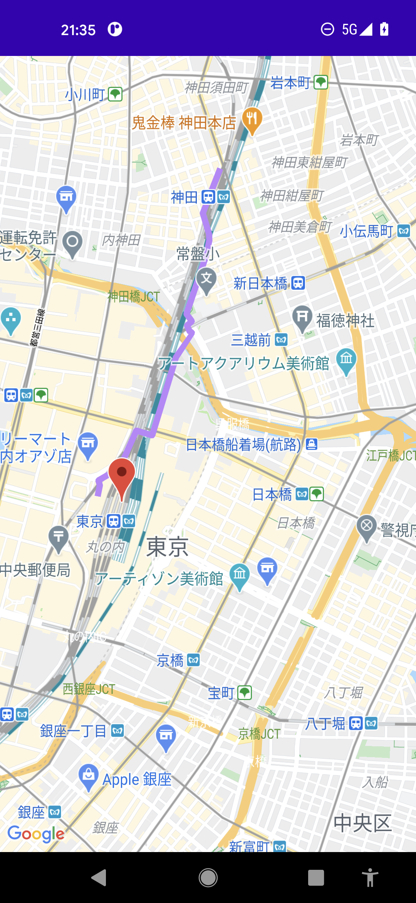

# java sample for Directions Api

## screenshot


## Usage

1. Please enable "Maps SDK for Android" and "Directions API" of API Project in Google Developer console

2. Set your MAPS API KEY in google_maps_api.xml
```xml
<string name="google_maps_key" templateMergeStrategy="preserve" translatable="false">MAPS_API_KEY</string>
```

3. Build and install the application

## Kotlin sample
https://github.com/LeoAndo/DirectionsApiKotlinSample
